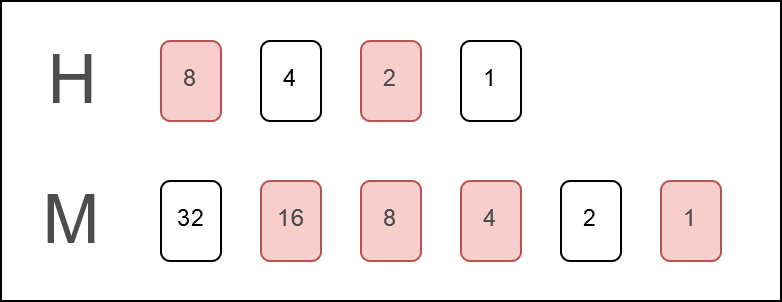

# Arduino binary clock
This is code for a binary clock controlled by an Arduino board. The clock display consists of two rows of LEDs, representing binary numbers for hours (4 bits) and minutes (6 bits) in a 12-hour format. The example diagram below shows the binary clock, where the figures labeled with numbers represent LEDs, with the red ones turned on. The time shown in the diagram is 10:29.

